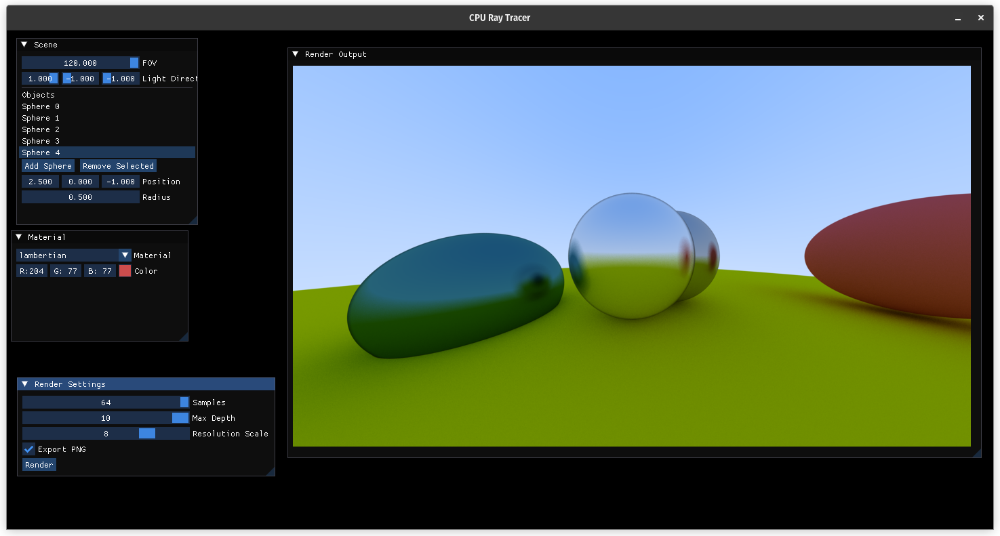

# CPU Ray Tracer

A multithreaded CPU-based ray tracing engine built from scratch in modern C++, with a real-time OpenGL preview window and interactive ImGui GUI. Supports recursive ray bouncing, multiple materials (diffuse, metal), and configurable scene controls.

## Overview of the UI

<p align="center">
  <br/>
  <em>UI Panel with ImGui controls</em>
</p>

<p align="center">
  <br/>
  <em>UI Panel - showing outputs</em>
</p>

<p align="center">
  <br/>
  <em>Medium quality render (time: 5s)</em>
</p>

<p align="center">
  <br/>
  <em>High-quality render (time: 3m 42s)</em>
</p>


[Here is a brief demo video (opens Google Drive)](https://drive.google.com/file/d/15kkNp-e7-jI2pOCzlNfwFs1qppRu-0B9/view?usp=sharing)
---

## Features

- Fully CPU-based ray tracing (no GPU compute or acceleration)
- Multithreaded rendering using `std::thread` and per-row work stealing
- Material system with:
  - Lambertian (diffuse)
  - Metal (reflective)
- Interactive object editor:
  - Add/remove spheres
  - Edit position, radius, material, color, fuzz
- Light direction and FOV control
- Resolution scaling with live low-res preview
- OpenGL-based output viewer (fixed 1000×562 viewport)
- Downsampled final render via `stb_image_resize`
- Scene rebuild on-demand
- Clean C++17 modular architecture
- CMake-based build system

---

## Architecture Overview

| Module        | Responsibility                       |
|---------------|---------------------------------------|
| `Vec3.h`      | Vector math (dot, cross, reflect, random) |
| `Ray.h`       | Rays with origin + direction          |
| `Camera.h`    | Perspective camera and ray generation |
| `Material.h`  | Material abstraction (`scatter()`)    |
| `Sphere.h`    | Ray-sphere intersection              |
| `Scene.h`     | Object manager + hit testing          |
| `Renderer.*`  | Multithreaded CPU ray tracer          |
| `UI.*`        | ImGui GUI controls                    |

---

## Build Instructions

### Prerequisites

- C++17
- CMake ≥ 3.10
- OpenGL 3.3
- GLFW
- GLAD
- ImGui (included via `vendor/`)

### Build Steps

```bash
git clone --recursive https://github.com/surenderpsm/cpu-ray-tracer.git
cd cpu-ray-tracer
mkdir build && cd build
cmake ..
make -j$(nproc)
./raytracer
```

---

## Sample Controls

- `FOV`: adjust perspective angle
- `Light Dir`: slider for light vector (affects Lambert shading)
- `Samples`: number of rays per pixel (higher = cleaner) (Higher than 10 throttles 8 core CPU)
- `Render`: run ray tracing (CPU-intensive)

---

## Planned Next

- BVH acceleration for large scenes
- Preview vs final render toggles
- More material types (glass, emissive)
- JSON scene save/load
- Progressive rendering

---

## Screenshots


---

## Author

Surender Soundiramourty — [@surenderpsm](https://github.com/surenderpsm)

---

## 🪪 License

MIT